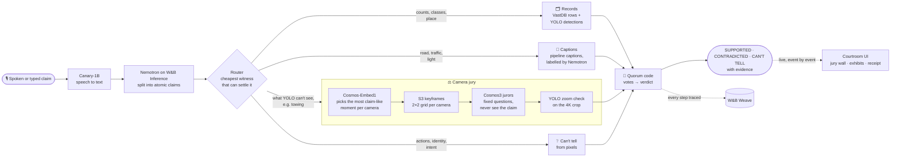

# PERJURY

**Every claim about the footage takes the stand.**

Say anything about a traffic video, by voice or by typing, and PERJURY puts it on trial. It splits the sentence into atomic claims and sends each one to the cheapest witness that can settle it: VastDB records, YOLO detections, the pipeline's captions, or a jury of cameras watched by Cosmos. Each claim gets a ruling of **SUPPORTED**, **CONTRADICTED** or **"the pixels can't tell"**, with the evidence on screen. The jurors never see the claim, and the verdict is computed by code, not by a language model.

Built for the [VAST Builders Challenge 2026](https://www.vastdata.com/lp/vast-builders-challenge) (San Francisco, Oct 2) on the event's pre-deployed video stack. Team 41.

**Live app:** https://team-41-vss.thecosmoslabs.com/app/

## Stack

| | Tech | How PERJURY uses it |
|---|---|---|
| **VAST Data** | `VastDB` | **Records witness.** Settles cheap claims (object classes, peak counts, scene metadata) across every segment of a scene before any GPU call. |
| | `S3` | Signed URLs to segment videos for juror keyframes and 4K evidence crops. |
| | `DataEngine` | The pre-built ingest pipeline (segment → YOLO → Cosmos captions → Embed1 → VastDB) whose output PERJURY reads. Evidence reels go back in through `videos/upload`. |
| | `VSS backend` | Login, detection sidecars, playback, `agent/search-and-answer` for the stock-agent comparison, and `videos/synthesize` for the witness stand. |
| **NVIDIA** | `Cosmos3 Reasoner` | **The jurors.** Fixed, claim-agnostic questions about 2×2 keyframe grids, plus 2D grounding boxes for "yes" votes. |
| | `Cosmos-Embed1` | **The prosecutor.** Picks the moments most likely to prove the claim, one per camera, so a CONTRADICTED verdict rests on the hardest evidence. |
| | `YOLO11` | Pipeline detections feed the records witness. A zoom check on the 4K crop must confirm every Cosmos "yes". |
| | `Canary-1B` | Speech-to-text for spoken testimony. It isn't wired into the default pipeline; PERJURY hooks it in. |
| | `Nemotron 3.5` | Splits a sentence into atomic claims, and labels captions contradiction-first (via W&B Inference). |
| **Weights & Biases** | `Inference` | Hosts the Nemotron calls: the claim splitter and the caption labeller. |
| | `Weave` | Traces every step of every verdict; 👍/👎 on a verdict is recorded as Weave feedback; the bench is a Weave Evaluation. |
| **CoreWeave** | `GPU host` | Serves Cosmos, Embed1, YOLO and Canary. The receipt shows the GPU-seconds each verdict used. |
| **Platform** | `Kubernetes` · `FastAPI` · `SSE` | The app runs in the team namespace at `/app`; verdicts stream to the browser event by event. |
| **SpaceXAI** | `Cursor` | The repo ships `.cursor/` rules and a `perjury-verify` skill, so a Cursor agent can call PERJURY as a tool. |

## How it works



Claims that can't be judged from fixed overhead cameras are never guessed: actions over time ("braked hard"), identity, intent and plate numbers always come back **UNPROVEN**, with the reason. The full routing table, the quorum maths and the prompts are in [docs/FINAL-IDEA-v3.md](docs/FINAL-IDEA-v3.md).

## Run it

```bash
./run.sh            # on the event VM: live mode. On a laptop: the offline demo → http://localhost:8080/
./run.sh fixture    # offline demo on fake Pack A data (FIXTURE banner on screen)
./run.sh live       # real endpoints (needs the team config, see live-env.example.sh)
./run.sh test       # test suite (183 tests)
```

`run.sh` creates a Python 3.12 venv, installs the requirements, and writes a debug log of every run to `logs/` (secret values are never written).

On the event VM, before the first live run:

```bash
cp live-env.example.sh live-env.sh && $EDITOR live-env.sh && . ./live-env.sh   # endpoints, gitignored
python preflight.py                                 # gates G0–G6: endpoints, index, Cosmos format, Canary
python -m perjury.index_i24 --sidecars              # VastDB → cache/i24_index.json
python -m perjury.prerun_scene_probes               # scene-wide juror answers → cache/scene_probes.json
deploy/deploy.sh                                    # team Kubernetes at /app
```

The bench: `python -m bench.run_bench --split dev`, then `python -m bench.report`. The held-out test split runs once, after `--freeze`.

## What is real and what is simulated

**Real in live mode:** every model call (Cosmos3, Embed1, YOLO, Canary, Nemotron on W&B), the VastDB index, the S3 video, the VSS backend, Weave traces, and the Kubernetes deployment.

**Fixture mode** runs the same pipeline on fake data and fake clients (`cache/fixture_*.json`, `perjury/fakes.py`) so the app and tests work offline. The UI shows a FIXTURE banner, and `bench/fill_numbers.py` refuses to put fixture numbers on a slide. **Replay mode** re-emits a recorded live run under a REPLAY banner.

**The footage we actually have:** team 41's archive holds 3 cameras of I-24 scene 1 (180 segments, about 5 minutes each). The plan assumed about 49 cameras over 3 scenes; scenes 2 and 3 are not on the event cluster. So the jury wall shows 3 live cameras and 15 NO FEED slots. Scene-wide claims need at least 8 usable cameras, so they come back UNPROVEN rather than being forced into a verdict.

## Repo map

| Path | What it is |
|---|---|
| `perjury/` | The pipeline: claim splitter, router, tiers, quorum, verdict templates, and a client per service |
| `app/` | FastAPI app, SSE verdict stream, and the courtroom UI (`app/static/`) |
| `bench/` | The 47-claim bench, Weave evaluation, stock-agent A/B, report and slide-number filler |
| `deploy/` | Kubernetes deploy without a registry: ConfigMaps for code and cache, a Secret from the team config, Ingress at `/app` |
| `tests/` | Unit and end-to-end tests (fixture mode) |
| `preflight.py` · `run.sh` | Event-day gates · one-command launcher |
| `.cursor/` | Official starter skills, plus PERJURY's rules and `perjury-verify` skill |

## Docs

- [docs/FINAL-IDEA-v3.md](docs/FINAL-IDEA-v3.md): the full design (routing table, 13 services, prompts, quorum maths, bench, gates, scripts)
- [docs/PLAN.md](docs/PLAN.md): the plan built to the judges' brief, with the 3-act demo
- [docs/BUILD-CONTRACT.md](docs/BUILD-CONTRACT.md): module interfaces, and how the build lines up with the official BUILD_DAY.md
- [BUILD_DAY.md](BUILD_DAY.md) · [ARCHITECTURE_REFERENCE.md](ARCHITECTURE_REFERENCE.md): the organizers' guides
- [docs/FINAL-IDEA-v2.md](docs/FINAL-IDEA-v2.md): ASSAY, the fallback idea (scenario mining over the PIE dashcam pack)
- [docs/SCRIPTS.md](docs/SCRIPTS.md) · [docs/QA-CARD.md](docs/QA-CARD.md) · [docs/slides/](docs/slides/): demo scripts, judge Q&A, stage deck

Footage: I-24 MOTION I24-3D dataset (Vanderbilt; Gloudemans et al., BMVC 2023), provided by the event organizers. PERJURY never reads plates or identifies drivers.
